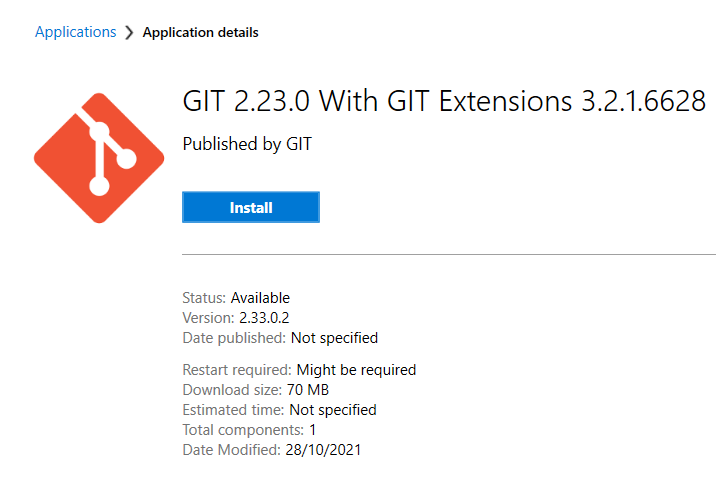
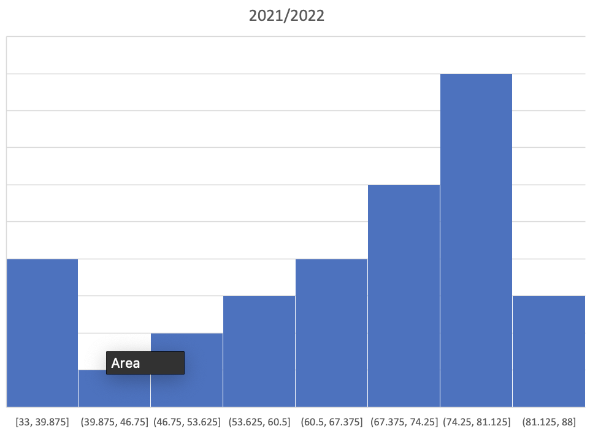

# GitHub Pages Creation using Jekyll and Just the Docs

## Introduction

This is a guide for creating webpages to host on GitHub Pages using a markdown editor and Jekyll.

Prerequisites:
- Jekyll <https://jekyllrb.com/docs/>
- Ruby (required for Jekyll) <https://rubyinstaller.org/downloads/>
- Microsoft Visual Studio <https://visualstudio.microsoft.com/downloads/>
- Github Desktop <https://desktop.github.com/>
- Just the Docs Template <https://pmarsceill.github.io/just-the-docs/>
- MathJax – addon for Jekyll which provides useful equation editing capability

## Installation Guide (Windows)
This guide is designed for installlign and configuring the required software on a LU IT Services managed Windows based PC.

### Installing Ruby and Jekyll
Link for install: <https://jekyllrb.com/docs/>

There is a specific set of instructions to install on a Windows PC (Windows is not an officially supported platform – however this has been shown to work): <https://jekyllrb.com/docs/installation/windows/>

To download Ruby go to: <https://rubyinstaller.org/downloads/>

Download the latest 64bit version WITH DEVKIT. Copy from the Downloads folder to a folder on the root of the C drive e.g. C:\software.
Run the installer with the default settings.

Make sure to enable the option to Run ‘ridk install’:

The installer will open a CMD window:

You just need to press ENTER to install the default required packages.

Open a command prompt and type the following to install Jekyll and the Bundler:
gem install jekyll bundler

Once completed, check Jekyll has installed with the command: jekyll - v

Jekyll should now be installed. However, there are some more command line steps to configure to use to develop GitHub Pages with the Just the Docs template… (to be updated)….

  
    

### Visual Studio
Download and install the latest version of Visual Studio (if not installed on your PC), link: <https://visualstudio.microsoft.com/downloads/>

You should sign in with an account (can use your University Microsoft account e.g. your Univerity account). Refer to this page for more information:
<https://docs.microsoft.com/en-us/visualstudio/ide/signing-in-to-visual-studio?view=vs-2022#how-to-sign-in-to-visual-studio>

Once signed in, you can then open a local project. This can be a GitHub repository cloned from GitHub or a new project.

To add: quick guide how to edit a Jekyll.

  
  

### GitHub Desktop

Website: <https://desktop.github.com/>

Note: This app is not available on the LU University Software Centre.

To install GitHub Desktop on a university managed PC: download GitHub Desktop from the above link then move the installer out of the Downloads folder to a folder on the root of the C drive or on the second HDD (if fitted). You can then launch the installer.  If you try to run the installer from the Downloads folder, it will be blocked by the IT Services.

Once installed, sign-in with your exiting GitHub account or create a new one.

Once GitHub Desktop is set-up, you can start by making a clone of the project hosted by BM on GitHub apco-docs:

Note: The University Software Centre does have GIT:

  
  

## Jekyll Markdown basic formatting guide
This is some examples of basic Jekyll markdown stled elements.

This guide was adapted from here:
<https://raw.githubusercontent.com/barryclark/www.jekyllnow.com/gh-pages/_posts/2014-6-19-Markdown-Style-Guide.md>

This is a paragraph, it's surrounded by whitespace. Next up are some headers, they're heavily influenced by GitHub's markdown style.

## Header 2 (H1 is reserved for post titles)##
### Header 3
#### Header 4
 
 
A link to [Jekyll Now]

link <http://github.com/barryclark/jekyll-now/>

Examples - lists:
* A bulletted list
- alternative syntax 1
+ alternative syntax 2
  - an indented list item

1. An
2. ordered
3. list

Inline markup styles: 
- _italics_
- **bold**
- `code()` 
 > Blockquote
>> Nested Blockquote 

 Syntax highlighting can be used by wrapping your code in a liquid tag like so:
{{ "  
/* Some pointless Javascript */
var rawr = ["r", "a", "w", "r"];
{{ "  

creates...

/* Some pointless Javascript */
var rawr = ["r", "a", "w", "r"];

 
Use two trailing spaces  
on the right  
to create linebreak tags  
 
Finally, horizontal lines
 
----
****

Example how to doa simple figure insert:

1). Original figure with no format commands:

2). Figure adjusted to a specific size:

----
  
  

## Original page from BM

This is the landing page (which becomes index.html).

The folders notes and labs are just to keep content separate.

The website structure is defined by the first few lines of each file between the "---" (folders are ignored).

- layout: home for index.html (this one) or page or default
- nav_order: order in navigation menu to the left of the page
- parent: for child doc name of the parent
- has_children: true or false
- use_mathjax: equations are rendered using mathjax if their are equations on the page then this should be set to true.
